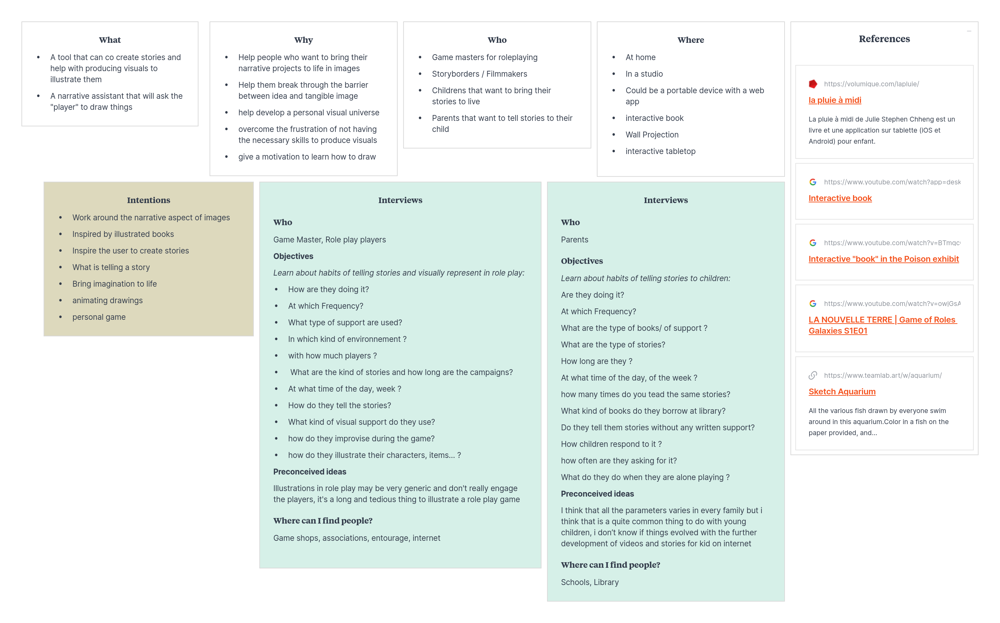

# Future of Drawing - Tell'Ink Project

Project of an passively interactive pin to show your identity

# Process

[1 November](#2023-11-01)

[15 November](#2023-11-15)

## 2023-10-19

After the briefing, I started the project with several ideas and guidelines in mind, I wanted to create an experience or an object that will allow people who don't usually draw or create visual art to make it more engaging and passive by using AI to transform things they already made or by using oral storytelling and transforming it into visuals or a playful way to do it. I then leaned into the field of role-playing games because it connected with my desire to turn oral "creations" and storytelling into something visual to show people who maybe don't normally draw how they can use their everyday language and ideas to make art.

## 2023-10-23

Before I had the opportunity to do my field research and assist in a real roleplaying session, asking questions et ceaetera, I wanted to do a big roundup of all the already existing devices, objects, software, online roleplaying sessions, and forums on the internet that can help me see what are the points already explored, what is liked by the community, and what can be further explored. I made a big board collecting all this data and started writing down some insights about these areas of reaserch. this also helped me fine tune my questions for interviews and field reaserch to really point out the things I found interesting during this initial reaserch online.

## 2023-10-30

Presented two prototypes linked to two different ideas: one of a interractive book used to incorporate your own drawings in your stories and procedurally animating them, and the other, more linked to my field research, an interactive table for playing role-play games.

After the exchange with tutors and other students, I decided to merge my ideas and broadening the subject of IRL role-playing to the subject of talking, discussing and telling stories alone, or in groups.

## 2023-10-31

Talked with the tutors about my idea of turning speech into personnal graphic language with new references and precised the formal and conceptuals questions I had to answer with testings and prototypes before continuing.

## 2023-11-01

Made a prototype to help me testing some design ideas and activated it with pepole from the class. The testing helped me realize some of the fundamentals i had to have in mind for this project concering user experience and how the interraction must take place. I pushed my research further concerning generative typography and graphic languages.

## 2023-11-15

Made some 3d visualisation mockups of the project to help me see how the final form can be and help think about the interraction a little more in depth. We talked about how the interraction with an external plateform may be confusing and put more weight on the project. So for now I decided to focus on the "pin" object and how it creates this identities based on speech.

## 2023-11-16

We had a presentation with people from caran d'ache and the feedbacks were similar to what we said yesterday with Alexia and Douglas. I was told that the project have good bases and need to evolve in a more concise way, ableing it to be more precise and easy to understand.