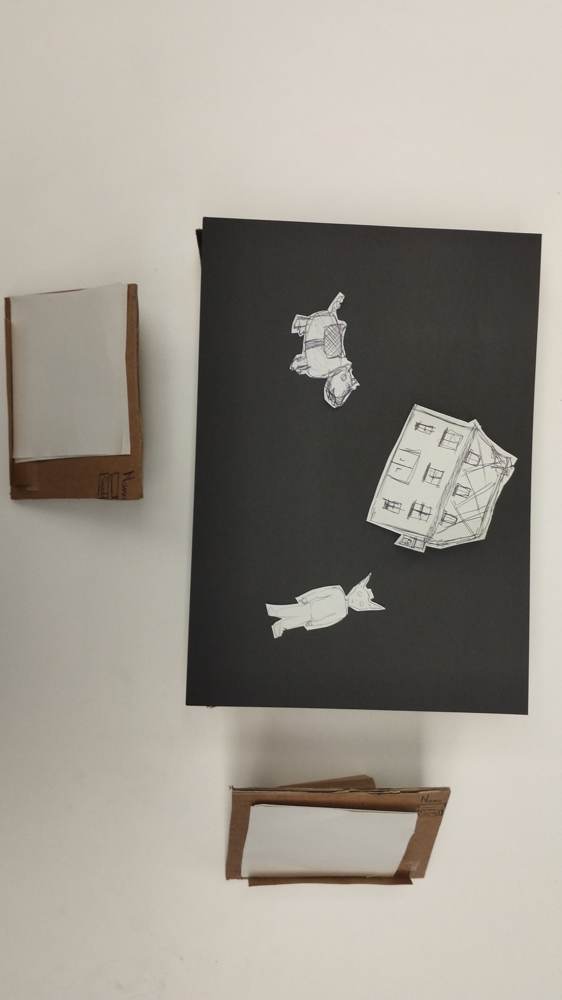
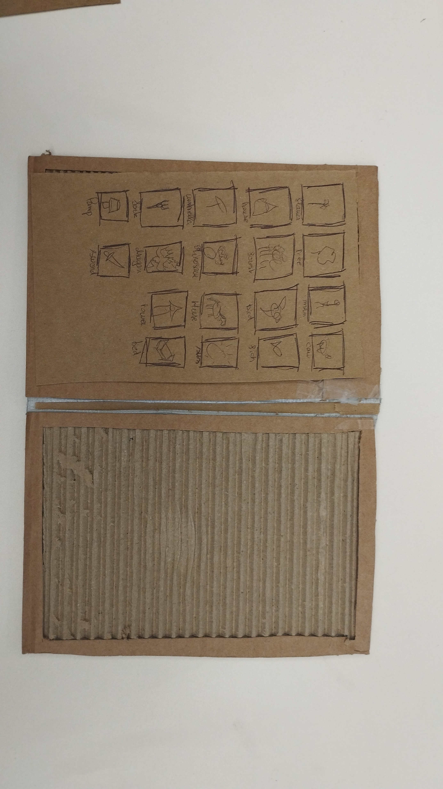
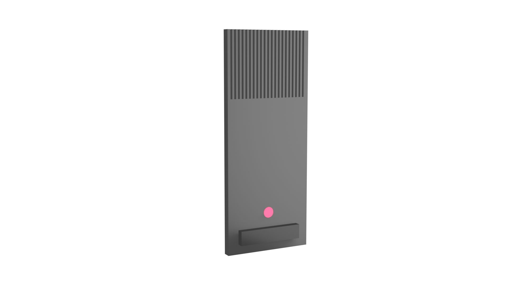
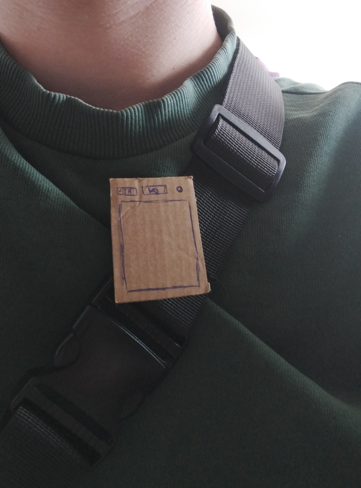
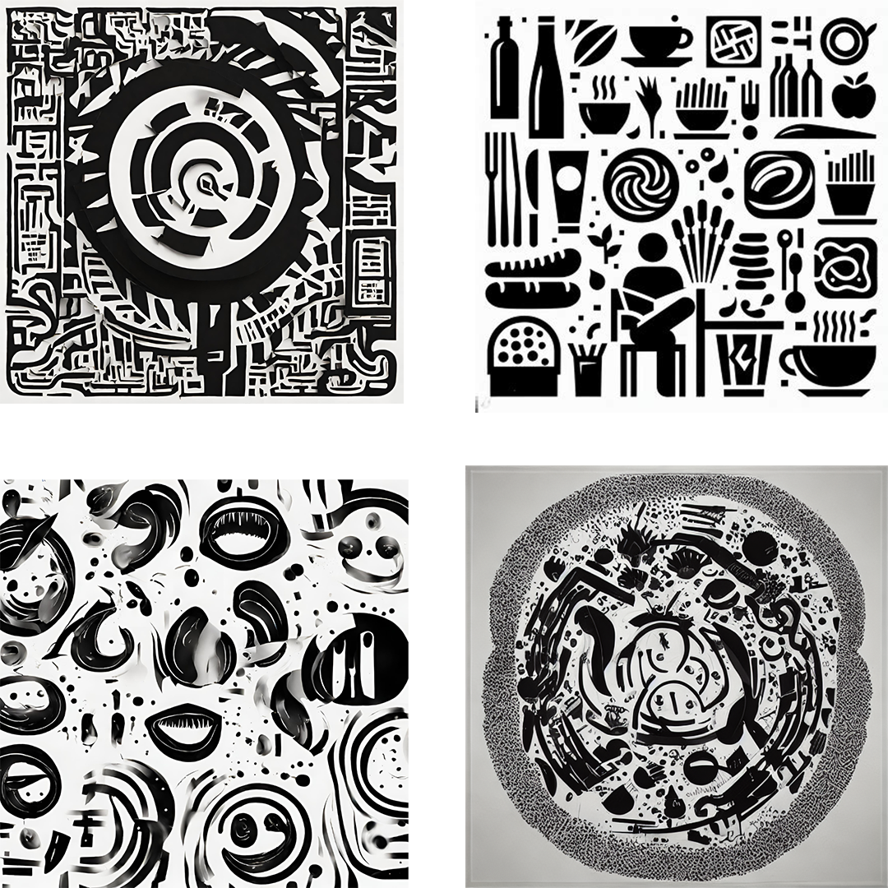
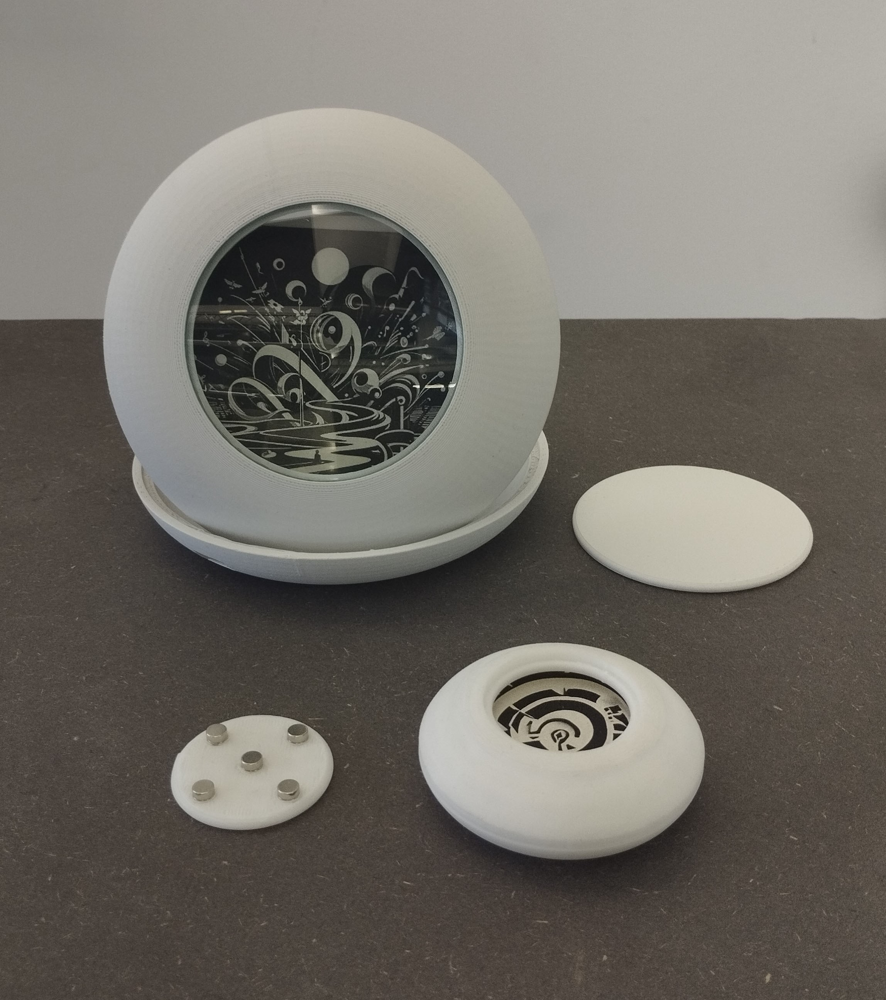

# Future of Drawing - Tell'Ink Project Process

Project of an passively interactive pin to show your identity

# Process

[November](#2023-11-01)

[December](#2023-12-05)

[January](#2024-01-09)

## 2023-10-19

After the briefing, I started the project with several ideas and guidelines in mind, I wanted to create an experience or an object that will allow people who don't usually draw or create visual art to make it more engaging and passive by using AI to transform things they already made or by using oral storytelling and transforming it into visuals or a playful way to do it. I then leaned into the field of role-playing games because it connected with my desire to turn oral "creations" and storytelling into something visual to show people who maybe don't normally draw how they can use their everyday language and ideas to make art.

## 2023-10-23

Before I had the opportunity to do my field research and assist in a real roleplaying session, asking questions et ceaetera, I wanted to do a big roundup of all the already existing devices, objects, software, online roleplaying sessions, and forums on the internet that can help me see what are the points already explored, what is liked by the community, and what can be further explored. I made a big board collecting all this data and started writing down some insights about these areas of reaserch. this also helped me fine tune my questions for interviews and field reaserch to really point out the things I found interesting during this initial reaserch online.

## 2023-10-26

I conducted my observation session in a roleplaying game, where I observed storytelling habits, game play behaviors, acceptance of change, and whether they used any kind of visual support. I also asked them a few questions about AI and related tools that I had learned about in my online research. The two main insights that came out of this were that they were quite reluctant to use AI to generate stories in order to keep their creative freedom, and that this area was already quite loaded with a lot of code and physical matter (dice, boards, accessories...). So I started to look for some ideas for objects that could either take place in this environment or in another area of oral storytelling.

## 2023-10-30

I then presented two prototypes related to two different ideas: one was an interactive book, mainly for children, that could be used to incorporate one's own drawings into one's own stories, or into existing ones, and then procedurally animate them. The other, more related to my field research, an interactive table for role-playing games where the player could draw visual assets on tablets and then have them all added to a library that can be used by the table to procedurally generate landscape and visuals by listening to what the player says.

After interacting with tutors and other students, I decided to merge my ideas and expand the theme of IRL role-playing to include talking, discussing, and telling stories alone or in groups.

## 2023-10-31

Talked with the tutors about my idea of creating an object or device that could transform speech and everyday storytelling into a library of generated personal graphic language. I presented new references linked to peapole creating new languages and written symbols in history aswell as some research on typography and visual pictograms. I then refined the formal and conceptual questions I needed to answer with tests and prototypes before proceeding.

## 2023-11-01

Made a new prototype with a different scenarii to help me test design ideas and activated it with people from the class and friends. The testing helped me to realize some of the basics I had to keep in mind for this project regarding the user experience and how the interaction must take place. For example, the main insights I gained from these sessions were that it's difficult to focus on an active system generating live icons during a discussion with 3+ people, and that reading a text is also very demanding in terms of focus and can't really allow people to focus on anything else while doing so. I also continued my research into generative typography and graphic languages.

## 2023-11-03

I used the different feedbacks and insights I got from the tests and my research to think about the final shape of the object, to try to find the scenario in which my object will be used and the angle the project will take. The field research and testing I did revealed an important point for the direction of the project: that talking and discussing are tasks that require a lot of concentration and don't often leave room for other interactions while doing them. So I decided to make a passive object that didn't require any direct input from the user other than his or her voice. Then I started thinking about how the user's voice could be transformed and how this newly created visual matter could be used or not. I also continued to create and experiment with AI for my visuals.

## 2023-11-13

I decided on a wearable device that, when activated, would listen to the user's recordings and generate pictograms and ideograms to form the aforementioned personal graphic library. Not sure if the device should have a screen to display the pictograms in real time or not, I started working on two different forms. I also started to shape out what the different uses would be and put down an early user journey. This early user journey consisted of having the user wear the object, activate it when speaking to maybe generate new pictograms when new words are said and otherwise display already existing ones and then have them all repertorized on an online platform linked to his wearable to be able to consult the sign they have generated or modify them.

## 2023-11-15

Made some 3D visualization mockups of the project to help me see what the final form might look like with differtens references and inspirations to help me think a little more deeply about the interraction and form. We talked with the tutors about how the interaction with an external platform might be confusing and add more weight to the project. It would be better to get rid of that part to make the project more understandable and poetic. So for now I decided to focus on the "pin" object and how it creates new visual identities based on speech.

## 2023-11-16  Half semester with caran d'ache

We had a presentation with people from caran d'ache and the feedbacks were similar to what we said yesterday with Alexia and Douglas about how confusing the whole user journey can be and how it should maybe be more poetic and less charged. I was told that the project have good bases and need to evolve in a more concise way, ableing it to be more precise and easy to understand.

## 2023-11-12  Links to Electronics and Form folders

Introduction to Electronics and Modeling, you can find the files, advancement and exercices here :

[Electronics](electronics)

[Modeling](form)

## 2023-12-05

I did some experimentation with the shape of the object and made some early final pieces to vizualize the functionality of the object and how to fit my electronics into it. I also took into consideration Laure's feedback on general rules for designing objects to make them appear thinner or smoother.

## 2023-12-10

Continued to experiment with image generation to get different process of generating that may create consistant style of pictogram-like images to display on the device. I finaly had 5 different ways of generating and prompts to test them during test day.

## 2023-12-14 Test days !

Find process and results [here.](presentations/2023_12_14/)

## 2023-12-20

More iterations of the prototype one fusion 360 and printed a first version I used for the test days.  Used this first print to figure out the problems of the prototype and change the file of the final Fusion 360 object to send at printing Atelier.

## 2024-01-09

Got my print of the big prototype used for the presentation containing the E-ink and printed myself a utopian version used for demonstration during jury.

## 2024-01-12

Finaly got my E-ink and started working on the code to display the images on it by wifi.

## 2024-01-15

Spent the whole weekend trying to unerstand the messy doc of this model of E-ink and learning python to code it. Finaly managed to get a code rolling that helped me displays a list of images on the E-ink that are send via a server on my computer.

## 2024-01-16

Used the different materials to polish the aspect of my two prototypes (big and 50% ones): using different sanding paper then applying two coats of primer then after letting it dry for 3 hours, painted it with three coats of the painting spay. Also did some tweaking withe the images that will be displayed during the presentation.

I took the evening to do some cool CGI background animation to play during my presentation. 

 

## 2024-01-17  JURY !

